    
##   Michael Schumacher F1 career history Dashboard

The purpose of this project is to give the user a visual overview of Michael Schumacher’s achievements during his time as a Formula 1 driver
 
## UX
 
Use this section to provide insight into your UX process, focusing on who this website is for, what it is that they want to achieve and how your project is the best way to help them achieve these things.

In particular, as part of this section we recommend that you provide a list of User Stories, with the following general structure:
- As a user type, I want to perform an action, so that I can achieve a goal.

This section is also where you would share links to any wireframes, mockups, diagrams etc. that you created as part of the design process. These files should themselves either be included in the project itself (in an separate directory), or just hosted elsewhere online and can be in any format that is viewable inside the browser.

Below are some sketches that I did to get an Idea of what information I was going to display and how it would be displayed
### Barchart displaying the total number of points scored per season
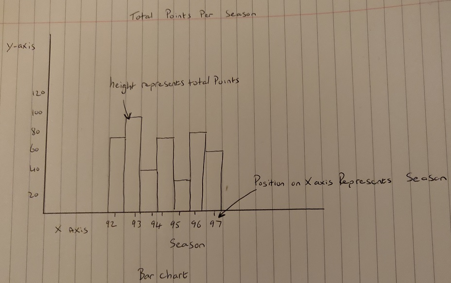

### Rowchart displaying the total number of podiums per team
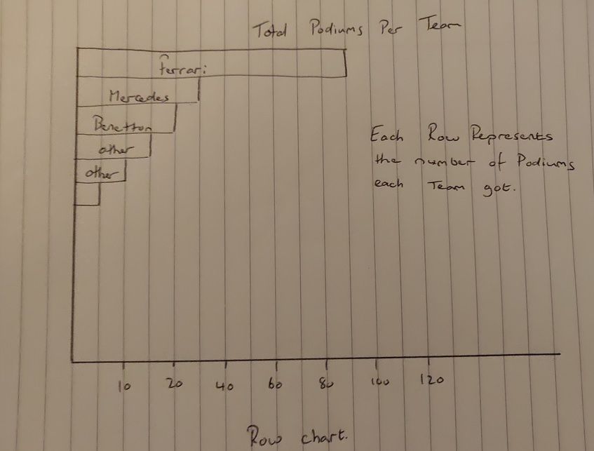

### piechart displaying the total number of podiums per team
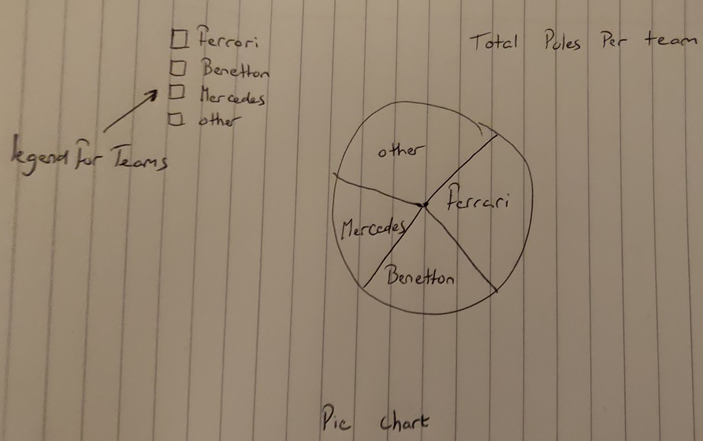

### Displaying all 3 charts on the home screen
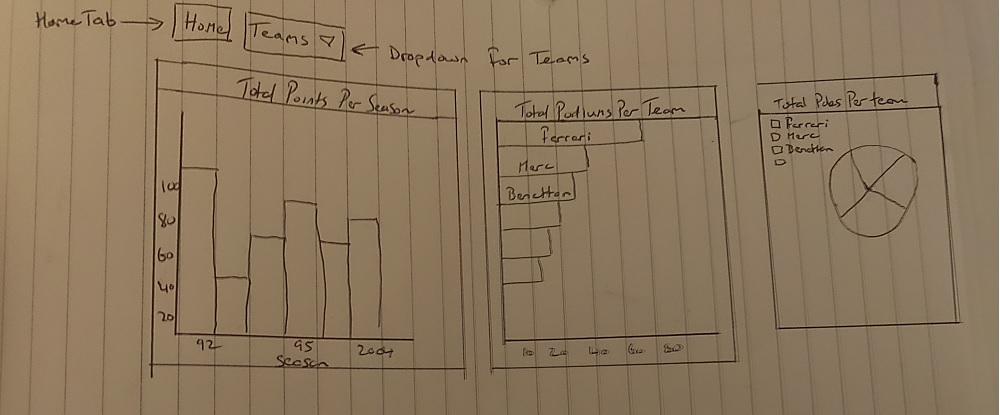

### for each team I designed a Stackedchart that would display multiple records for that team
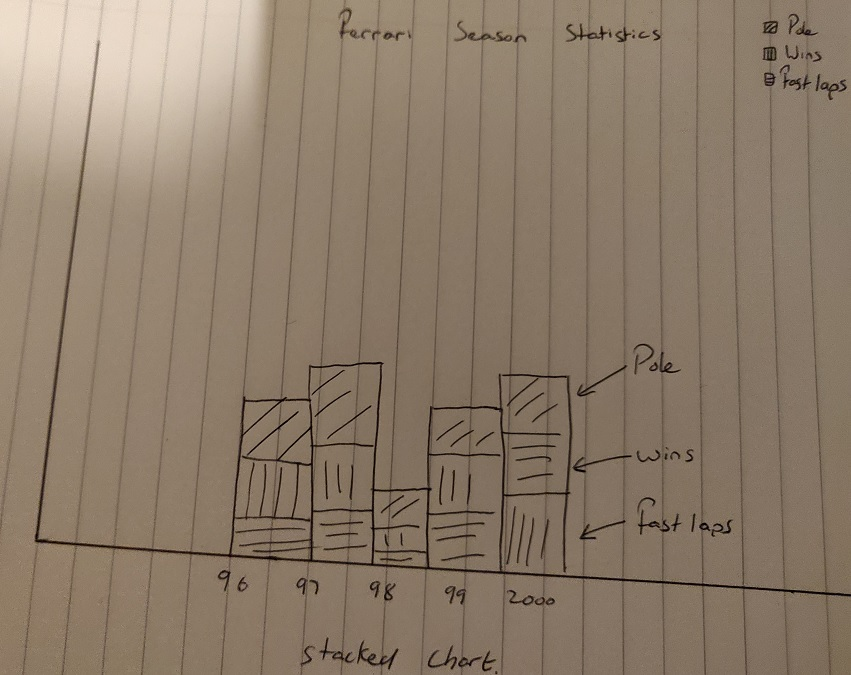

## Features
 
### Existing Features
- Feature 1 - From the home page(index.html) the user has the option of selecting from the dropdown Menu which is a list of Teams that Michael Schumacher has raced for.

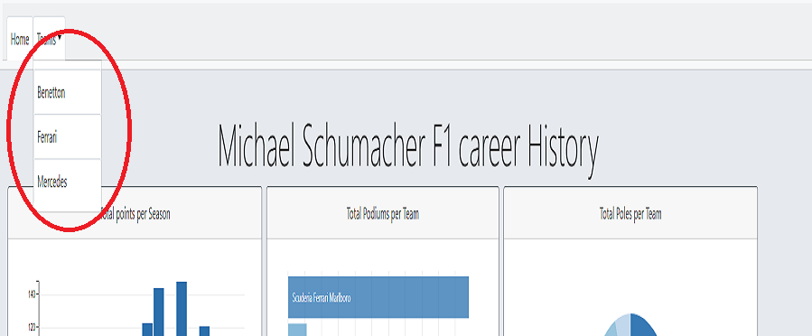

- Feature 2 - A user Can hover over any section(season) of the barchart(Total points per season) and information detailing the year and total points for that year will be displayed on screen

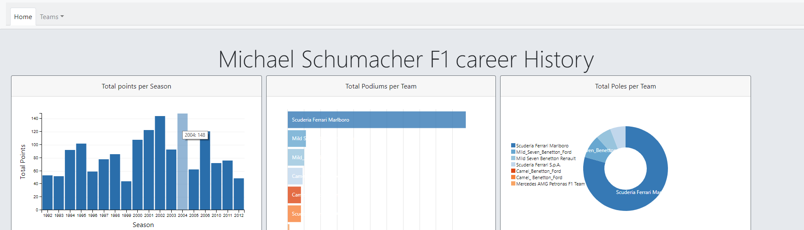

- Feature 3 - The 3 graphs on the Homepage are interlinked so the user can Filter information by click the left mouse button on a chosen segment of one of the graphs.

As an example I have deselected all of the years that he drove for ferrari from the barchart and the 2 charts on the far right are now only displaying the information relating to the remaining teams.

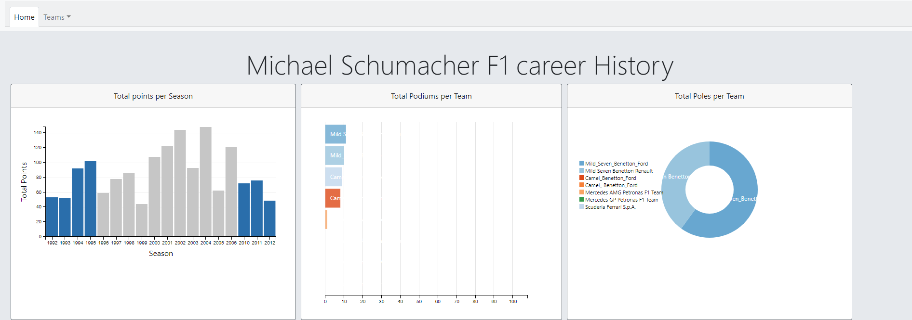

- Feature 4 - On all of the Team pages The user is able to display only the information that they want to see. This chart is a stacked chart and by hover over the legend of a particular statistic.

If a user hovers over the pole position legend then only this information will be displayed and the rest will be ghosted out.

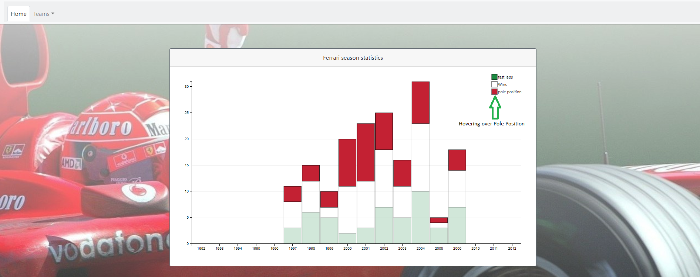

### Features Left to Implement

- A link to download graphs in PDF format

## Technologies Used

- [D3( data driven document)](https://cdnjs.cloudflare.com/ajax/libs/d3/3.5.17/d3.min.js)
		
A javascript which I used for creating interactive data	visualizations

- [Crossfilter](https://cdnjs.cloudflare.com/ajax/libs/crossfilter/1.3.12/crossfilter.min.js  )
	
Crossfilter is a javascript library which it makes it possible to interact with data sets 
 

- [DC](https://cdnjs.cloudflare.com/ajax/libs/dc/2.1.8/dc.js)

DC is a charting library built on top of D3

- [QUEUE](https://cdnjs.cloudflare.com/ajax/libs/queue-async/1.0.7/queue.min.js) 
	 

- [DC.min.css](https://cdnjs.cloudflare.com/ajax/libs/dc/2.1.8/dc.min.css)
	
CSS stylesheet libraries for dc

- [bootstrap](https://stackpath.bootstrapcdn.com/bootstrap/4.1.3/css/bootstrap.min.css) 

Bootstrap framework I used for setting the look and feel of the project  

- [JQuery](https://code.jquery.com/jquery-3.3.1.slim.min.js)   

Used to make the dropdown menu functional

- [bootstrap.min.js](https://stackpath.bootstrapcdn.com/bootstrap/4.1.3/js/bootstrap.min.js)

Bootstrap  javascript libraries for interacting with elements  within  the DOM. For this project it hides the nav menu items when in mobile format

- [csv to json converter](https://www.csvjson.com/csv2json)

After saving the table data in excel into csv format, I then used the following website to convert it to json as it is much easier to read and modify

## Testing

In this section, you need to convince the assessor that you have conducted enough testing to legitimately believe that the site works well. Essentially, in this part you will want to go over all of your user stories from the UX section and ensure that they all work as intended, with the project providing an easy and straightforward way for the users to achieve their goals.

Whenever it is feasible, prefer to automate your tests, and if you've done so, provide a brief explanation of your approach, link to the test file(s) and explain how to run them.

For any scenarios that have not been automated, test the user stories manually and provide as much detail as is relevant. A particularly useful 

1. Contact form:
    1. Go to the "Contact Us" page
    2. Try to submit the empty form and verify that an error message about the required fields appears
    3. Try to submit the form with an invalid email address and verify that a relevant error message appears
    4. Try to submit the form with all inputs valid and verify that a success message appears.

In addition, you should mention in this section how your project looks and works on different browsers and screen sizes.

Site works well across the following browsers:

Chrome

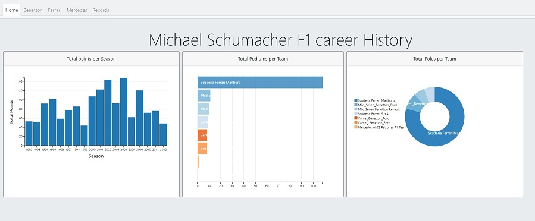

Firefox

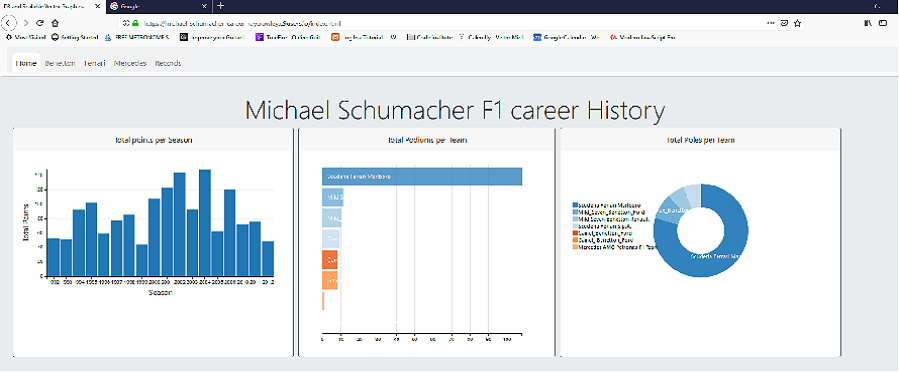

Opera

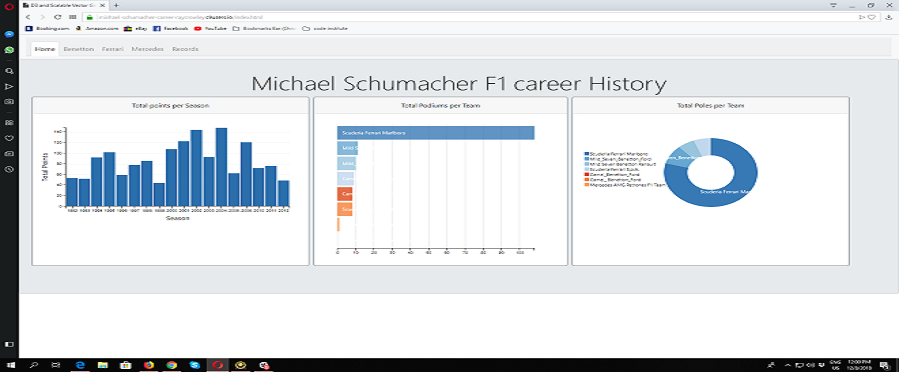

Explorer

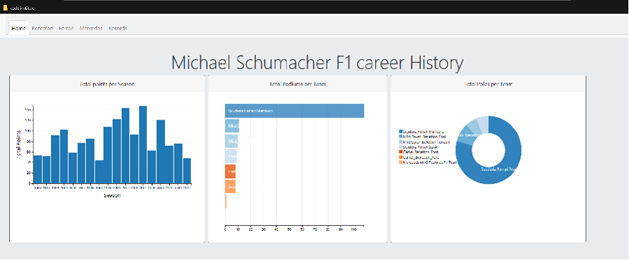

### Mobile compatibility

Due to the nature of this project it is only really functional from the perspective of a desktop computer and is not suitable for mobile devices.

## Deployment

For deployment of this project I used GITHUB as a hosting platform. This process was done over several commits.

As I went through this process of submitting commits, the Initial commit may be visually different to the final version but the behaviour of the graphs and the data that is displayed to the user stayed the same.

for the Initial commit I took the following steps:
Opened a Bash terminal and typed the following commands command 
### git init 
Initialize git environment
### git status
List all files that have not been commited or have been modified
### git add *
Adds all files
### git commit -m "initial commit"
Adds a comment to the commit
### git remote add origin https://github.com/rayme1975/michael-schumacher-career.git
Creates link for github repository
### git push origin master
push changes to repository

I am then requested to provide a username and password to submit changes.

Subsequent commits follow the same steps only that there is no need to create another remote for origin. All that is required is to type the command

### git push

You will still be required to login

## Credits

### Content

The information displayed in the dashboard is based on the following Table

https://en.wikipedia.org/wiki/Michael_Schumacher#Career_summary

### Media

- I used the following images for this project

-[Mercedes F1 car 2012](https://www.google.ie/search?hl=en-IE&authuser=0&biw=1920&bih=889&tbm=isch&sa=1&ei=-MkLXOvVGZmR1fAPw7azwAI&q=michael+schumacher+mercedes&oq=michael+schumacher+mercedes&gs_l=img.3..0l3j0i30l3j0i24l4.641033.642759..643064...0.0..0.69.478.8......0....1..gws-wiz-img.MEzE0f1WJso#imgrc=5v9GpAUMP06bGM:)

-[Benetton F1 car 1995](https://www.google.ie/search?hl=en-IE&authuser=0&biw=1920&bih=889&tbm=isch&sa=1&ei=sdALXIDjE-WM1fAPp_ai0AY&q=michael+schumacher+benetton+1995&oq=michael+schumacher+be&gs_l=img.1.3.0j0i8i30j0i30l4j0i8i30l2j0i24l2.3319.5541..7373...0.0..0.70.187.3......0....1..gws-wiz-img.......0i67.WTLxULVOEsQ#imgrc=aaU5Gl1tT9hDCM:)

-[Ferrari F1 car 2004](https://www.google.ie/search?hl=en-IE&authuser=0&biw=1920&bih=889&tbm=isch&sa=1&ei=rs8LXKW_ONyQ1fAP_J-h2AU&q=michael+schumacher+ferrari&oq=michael+schumacher+ferr&gs_l=img.1.0.0l7.496237.496796..498531...0.0..0.60.228.4......0....1..gws-wiz-img.......0i67.PDZ4eHNaK84#imgrc=j8-6ZedeXvuNDM:)

### Acknowledgements

- I used the following course to get a better understanding of the 	structure of D3 and SVG

https://www.udemy.com/masteringd3js/

- I found this tutorial to be a very helpful resource

https://www.tutorialspoint.com/dcjs/

- Dc example graphs

https://dc-js.github.io/dc.js/examples/

